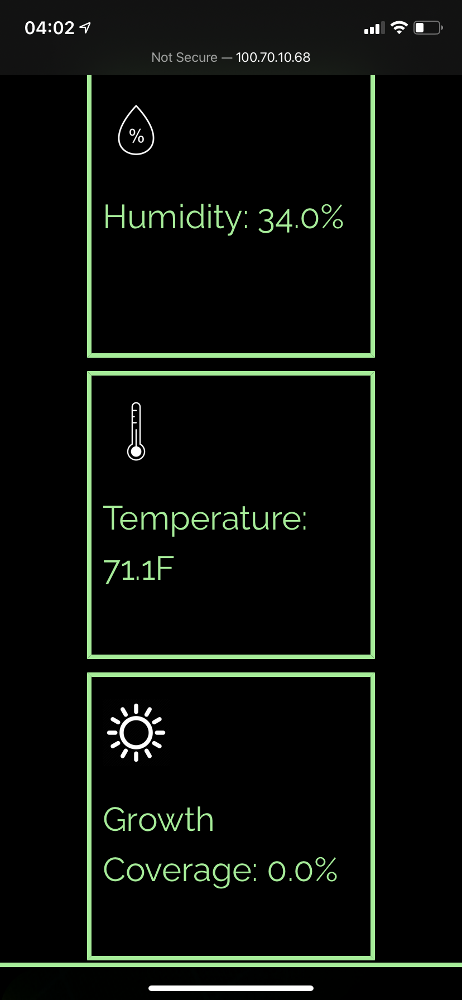
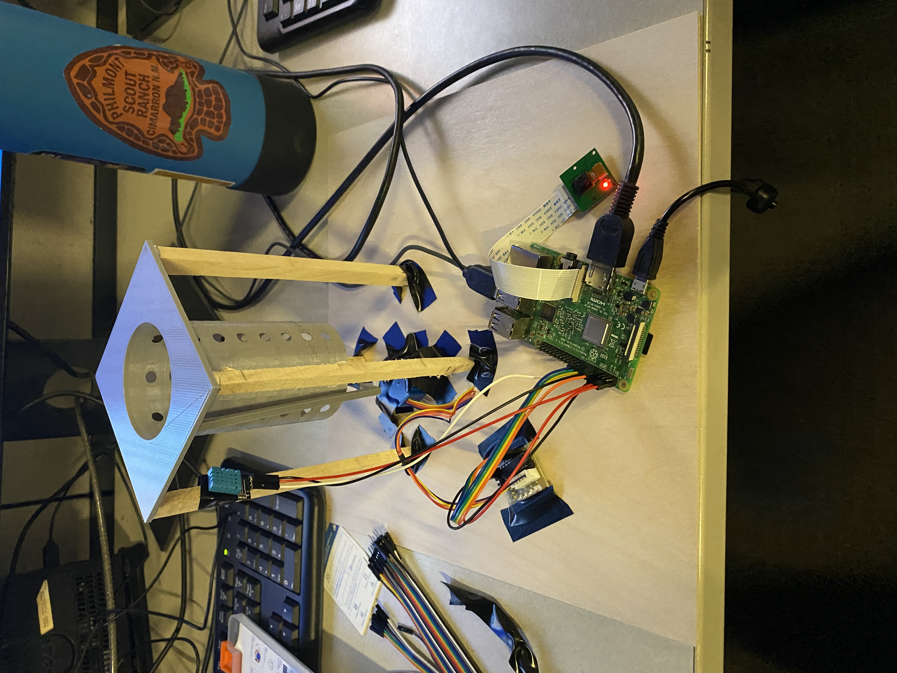

# Pleurotus-Ostreatus-Automaton

## Brief Description
Pleurotus-Ostreatus-Automaton is an automatic oyster mushroom farm complete with a web application for monitoring the state of the mushrooms.

### Detailed Description
We are essentially building an autonomous robotic oyster mushroom farm, wherein oyster mushrooms are grown in a controlled environment in coffee grounds or sawdust (which would otherwise be disposed) and harvested autonomously. We can hence produce oyster mushrooms, known to have many health benefits, and the bi-product from the waste actually becomes a very good fertilizer, important amid a global soil erosion crisis.

Our current prototype holds a 3D-printed cylinder with holes in it—mushrooms grown in the cylinder are forced to protrude through these holes. We also have a model blade, which can autonomously spin around the cylinder, chopping the mushrooms which can then be collected. We also have a humidity and temperature sensor that allow us to monitor the conditions of the growth environment. Our fully developed plan also includes a vacuum that collects mushroom spores, allowing us to continuously replace harvested mushrooms, and a water pump and filament to modify, respectively, the humidity and temperature of the environment.

We currently have a web app integrated with a camera sensor to enable live monitoring of the environment and manual controls if necessary, and a computer vision pipeline that can detect when mushrooms are first present and when they begin flowering, at which point the harvest will automatically begin with no human intervention necessary. We are working towards integrating a neural network that will over time monitor the progress given the environmental conditions to assess the optimal values; these features will allow us to become an efficient, profitable, and sustainable farm with very minimal labor.
## Images

## Next Steps

The next steps for this project would be building a full scale MVP and cleaning up the code to allow for more easily sustainable code.

## links

[devpost](https://devpost.com/software/oyester-mushroom-harvester)
[presentation](https://docs.google.com/presentation/d/19EiZ7T7d_PWRLdc_MkPWV6oT4SqFDwOcTgxzNNcQWdE/edit?usp=sharing)